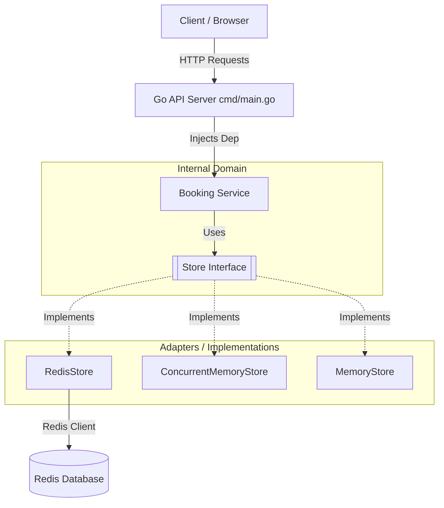

# Cinema Ticket Booking System

Starter code for a practical demonstration of how to construct a robust ticket booking system. This repository highlights the steps needed to solve the classic double-booking problem, handle high contention without race conditions, and provide a good user experience when selecting seats.

## ⚠️ The Problem: Double Bookings

Two users click "Book" on seat A1 at the exact same instant. Only one should win.

```bash
User A ──► read seat A1 → "free" ──► write booking ──► success
User B ──► read seat A1 → "free" ──► write booking ──► ???
```

Without any protection mechanisms, both read the seat as "free", and both writes succeed. Now two people show up for the same seat at the cinema! This is a classic example of a **Race Condition**.

---

## 🏎️ Concurrency & Resolving Race Conditions

A **Race Condition** occurs when multiple processes or threads try to access and modify shared data simultaneously, and the final outcome depends on the unpredictable timing (or "race") of their execution. To fix this, we use concurrency control strategies:

### 1. Pessimistic Concurrency Control (Used right here)
*   **Concept**: *Assume conflicts will happen.* Lock the resource upfront.
*   **How it works**: Before reading or modifying data, the system places a lock on it. No other process can read or write that data until the lock is released.
*   **Examples**: Go's `sync.Mutex`, SQL's `SELECT ... FOR UPDATE`, and our exact Redis `SETNX` implementation.
*   **Pros/Cons**: Guaranteed consistency and no conflicts. However, it can create performance bottlenecks or deadlocks when many users try to access the same resource.

### 2. Optimistic Concurrency Control (OCC)
*   **Concept**: *Assume conflicts are rare.* Don't lock upfront.
*   **How it works**: Records are assigned a version number or timestamp. A process reads the record and its version. When it tries to save an update, it includes this version. The system only accepts the update if the version in the database still matches. If it changed (someone else updated it), the process fails and usually retries.
*   **Examples**: `UPDATE table SET status='booked' WHERE id=1 AND version=2`
*   **Pros/Cons**: Highly performant for read-heavy applications with few conflicts. Under heavy write contention, it results in many rejected requests and retries.

### 3. Queueing / Actor Model (Other methods)
*   **Concept**: Turn concurrent actions into a predictable sequence.
*   **How it works**: All booking requests are funneled into a single Message Queue (e.g., Kafka, RabbitMQ) or an Actor. A single worker processes the queue one by one sequentially.
*   **Pros/Cons**: Eliminates concurrent modifications completely. Harder to implement synchronously (users have to wait asynchronously to find out if they got the ticket).

---

## 🏰 Architecture

Below is a visualization of the internal components and data flow in our Go backend.



The project follows a modular structure separated into distinct packages:

*   **`cmd/main.go`**: The entry point of the application. It handles the server startup, HTTP request routing, and dependency injection wiring.
*   **`internal/booking/`**: Contains the core domain logic for the booking system.
    *   **Stores**: `MemoryStore`, `ConcurrentMemoryStore`, and `RedisStore` to handle data persistence and concurrency checks.
    *   **Service**: Contains the business logic (`service.go`).
    *   **Handler**: Maps HTTP endpoints to our service logic (`handler.go`).
*   **`internal/adapters/`**: Adapters for external dependencies. Contains the setup for the Redis client connection.
*   **`static/`**: Contains HTML, CSS, or JS files served by the application's base URL route file server.

## 🚀 How to Run the Code

To run this project locally, you need Go and Docker installed.

1.  **Start Redis**:
    Start the Redis server using Docker Compose (assuming you have a `docker-compose.yaml` present):
    ```bash
    docker compose up -d
    ```

2.  **Run the Go API**:
    In a separate terminal, start the Go server:
    ```bash
    go run cmd/main.go
    ```
    The server will start at `http://localhost:8080`.
    *(Note: You can access the UI by going to the base URL in your browser).*

## 🛣️ API Routes

*   `GET /`: Serves the base frontend HTML interface from the `static` directory.
*   `GET /movies`: Returns a list of available movies (e.g., Inception, F1).
*   `GET /movies/{movieID}/seats`: Retrieves a list of booked/held seats for a specific movie so frontend UIs know which seats are blocked.
*   `POST /movies/{movieID}/seats/{seatID}/hold`: Places a temporary lock (a hold) on a given seat for the user. Returns a `sessionID`.
*   `PUT /sessions/{sessionID}/confirm`: Completes the purchase/booking process, changing the temporary hold into a confirmed booking.
*   `DELETE /sessions/{sessionID}`: Explicitly releases a held seat (or it expires eventually based on TTL).

## 🔒 Locking Implementation Details

To guarantee that a seat cannot be double-booked, we implement **Pessimistic Locking**.

*   **InMemory**: In `ConcurrentMemoryStore`, we utilize a `sync.RWMutex`. We call `.Lock()` during booking meaning no other thread can read or write to our map at the same time until `.Unlock()` is called.
*   **Redis (Production Ready)**: In `RedisStore`, we achieve pessimistic locking using the Redis `SETNX` (Set if Not Exists) command. When holding a seat, we try to create a lock key (e.g., `seat:Inception:A1`). If the operation returns `OK`, this user won the lock. If it fails, another user holds the seat and we reject the new request immediately, preserving data integrity in distributed environments.

## 🧪 Testing and Comparing Concurrent Solutions

Inside `internal/booking/service_test.go`, we have created stress tests to prove our implementation works during extreme load.

We spin up **100,000 independent goroutines**, all trying to book exactly the same seat (`screen-1`, `A1`) at the exact same instant. 

The test succeeds if and only if:
1.  **Exactly 1** goroutine successfully books the seat.
2.  **Exactly 99,999** goroutines gracefully fail with an `ErrSeatAlreadyBooked`.

We initially compare:
*   `MemoryStore`: Standard Go map (Not thread-safe). Concurrency results in race conditions leading to double bookings and Go runtime panics.
*   `ConcurrentMemoryStore`: Fixes panics utilizing `sync.RWMutex`, solving the issue for a single-node API.
*   `RedisStore`: Employs `SETNX` solving the problem not just natively, but in a distributed multi-node architecture.
